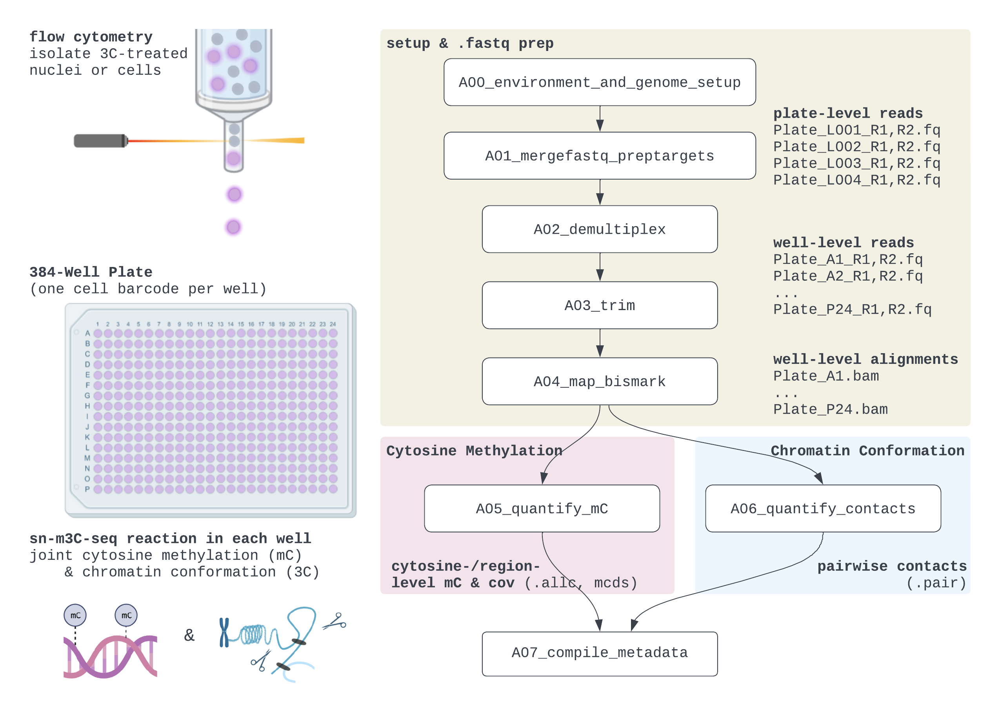
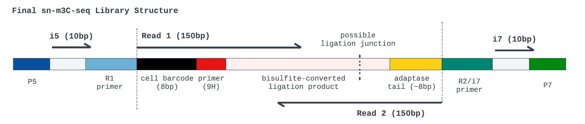

# Detailed Overview



## Library Structure


Each read contains bisulfite-converted DNA sequence that may have a ligation junction at some unknown position (e.g., could be in the middle of Read 1, Read 2, or not observed at all). For expected nucleotide sequences, please see our library's [seqspec](https://igvf.github.io/seqspec/specs/sn-m3C-seq/spec.html).


## Table of Contents

- [A00_environment_and_genome_setup](#a00_environment_and_genome_setup)
- [A01_mergefastq_preptargets](#a01_mergefastq_preptargets)
- [A02_demultiplex](#a02_demultiplex)
- [A03_trim](#a03_trim)
- [A04_map_bismark](#a04_map_bismark)
- [A05_quantify_mC](#a05_quantify_mc)
- [A06_quantify_contacts](#a06_quantify_contacts)
- [A07_compile_metadata](#a07_compile_metadata)

---

<br><br><br>
# A00_environment_and_genome_setup

* Clone (`git clone`) or download this repo as a .zip file [from the releases page](https://github.com/chooliu/snm3Cseq_Pipeline/releases). Rename the resulting folder to an informative "project directory" to hold scripts & outputs.

* Install the dependencies in `Documentation/snm3Cseq_taurus.yaml`. Conda installation highly recommended for convenience/reproducibility.
```
module load anaconda3 # or otherwise access conda
conda env create -f Documentation/snm3Cseq_taurus.yml
```

* Prep the following directory structure in a new "project directory" where output files will be stored.
```
# dir_proj=/u/project/cluo_scratch/chliu/IGVF_iPSC_snm3Cseq_YZCL47
# mkdir $dir_proj; cd $dir_proj
# mkdir Metadata Notebooks Scripts
```
* ⚠🚨 Using either the included Juypter `Notebooks` or a text editor *, customize `snm3C_parameters.env` (which minimizes hard coding e.g., of filepaths) and `A01b.py` + `A01c.py`, especially checking for:
    - (i) compatibility with your compute/scheduler infrastructure and sequencing depth\
    (resource suggestions assume ⪅ 3 million total reads/well average; generally 32 plates or fewer/NovaSeq S4)
    - (ii) genome/reference organism
    - (iii) **job array ranges**, which vary based on the number of 384-well plates profiled\
    \
    The array range `-t 1-Nplates` is used for tasks performed at the plate level (e.g., demultiplexing) whereas `-t 1-Nbatches` processes selected wells of a given plate at a time for more intensive tasks like alignment. By default, each "batch" contains 24 cells (one wellplate row) and thus Nbatches = 16 rows/plate * Nplates.

* Run `*.sub` submission scripts `A00a`, `A00b`, ..., `A01a`, in order, starting with reference genome prep (`.fasta` sequence and `.gtf` annotations) with the following commands.
* Subsequent scripts `A02` through `A07` require no customization besides specifying `-t 1-Nplates` and `-t 1-Nbatches`.
* These scripts are tailored for the Sun Grid Engine (SGE) infrastructure of the Hoffman2 UCLA cluster, with the resources marked with `#$` lines in the `.sub` header; change as needed.
* Each script saves info to the `sublogs/` folder for troubleshooting.
* (*) The Notebooks and Scripts uploaded to this repo are equivalent, but using Jupyter can be nice for a few fast tasks that can be more intuitive interactively (`A01b` and `A01c`) while also doubling as a text editor: cells that start with  `%%bash; cat > ../Scripts/myscript.sub` which merely write the cell contents to `${dir_proj}/Scripts/myscript.sub` but do not run or submit the tasks themselves.

### A00 Commands to Run ⭐

Each section has a code block showing typical `qsub` commands. These can be run all at once if `-hold_jid`/`-hold_jid_ad` or equivalent is supported by the scheduler. 

```
# check desired ref genome, paths, & snm3C_parameters.env before running
qsub Scripts/A00a_genome_dl_index.sub  
qsub Scripts/A00b_genome_prep_bismark.sub
qsub Scripts/A00c_annotations_bed.sub
```

**Always submit from within the project directory.** (Or if `qsub -cwd` flag not supported, edit to use absolute filepath for `.env` file, followed by `cd $dir_proj`)

<br><br><br>
# A01_mergefastq_preptargets

### A01 Commands to Run ⭐

```
qsub Scripts/A01a_merge_lanes.sub # * -t 1-Nplates
qsub Scripts/A01b_plate_metadata.sub
```

* Our raw data is demultiplexed at the plate-level (i5/i7 index reads) and base-called via Basespace/`bcl2fastq`. The resulting nomenclature is effectively `Plate_L00*_R1.fq.gz` (Read 1) and `Plate_L00*_R2.fq.gz` (Read 2). The "Plate" name usually contains study-specific metadata separated by dashes that are useful to retain.
* **A01a:** We generally assume no substantial lane-effect and concatenate a given plate's files into `fastq_raw/Plate_R1.fq.gz` and `fastq_raw/Plate_R2.fq.gz`. (Make sure the Plate identifier is unique.)
* **A01b:** Extract plate-level metadata from `.fq` names.
* **A01c:** The anticipated filepath intermediate and final file outputs are predictable for each well, so we expand the plate-level metadata into well-level metadata. Each well corresponds to one nucleus/cell, and is uniquely identified by its "`wellprefix`" (Plate_Well, where Well is the 384-well plate position in {A1, A2, ..., A23, A24, B1, ..., P23, P24}).
* ⚠🚨️ **The number of wells per batch is also defined in A01c.** There may be a tradeoff between the number of tasks and resources per task needed depending on the architecture of your cluster (e.g., if getting `h_rt=24:00:00` in bismark mapping is bottleneck, can switch to e.g., 12 wells/batch & 12 hours with twice as many jobs in the job array.) Time and resource suggestions are given in each submission script/Notebook.

### Example of Plate & Well Files
```
# one plate:
20231005-3C29D1-Pos1-C04_S25_L001_R1_001.fastq.gz
20231005-3C29D1-Pos1-C04_S25_L001_R2_001.fastq.gz
...
20231005-3C29D1-Pos1-C04_S25_L008_R1_001.fastq.gz
20231005-3C29D1-Pos1-C04_S25_L008_R1_001.fastq.gz
```

In A01, these are concatenated across sequencing lanes into `20231005-3C29D1-Pos1-C04_S25_R1.fastq.gz` and `_R2.fastq.gz` (verify that this filename still distinguishes the plate from others).

Plate names are parsed into `Metadata/A01b_plate_metadata.csv` (the dash-separated line, timepoint info specific for our 32-plate IGVF pilot experiment):
```
                           plate   dateseq   sample  sort plateindex line  time  platenum  
0   20231005-3C29D1-Pos1-C04_S25  20231005   3C29D1  Pos1    C04_S25  C29   1         1  
1    20231005-3C29D1-Pos2-A02_S1  20231005   3C29D1  Pos2     A02_S1  C29   1         2  
2  20231005-3C29D12-Pos1-B06_S16  20231005  3C29D12  Pos1    B06_S16  C29   12        3
                                             ...
30   20231005-3C39D9-Pos1-C09_S30  20231005   3C39D9  Pos1    C09_S30  C39   9        31  
31    20231005-3C39D9-Pos2-A07_S6  20231005   3C39D9  Pos2     A07_S6  C39   9        32
```

Finally, `Metadata/A01c_well_filepaths.csv` has one row for well, where `Nplates*384` total wells are expected. Each well is uniquely identified by it's "`wellprefix`". The first wellplate row of `20231005-3C29D1-Pos1-C04_S25` constitute the first job task `batchnum = 1` by default (`Nbatches = Ncells/24`).

```
                            wellprefix  batchnum  A04a_bam_final
1      20231005-3C29D1-Pos1-C04_S25_A1         1   mapping_bismark/20231005-3C29D1-Pos1-C04_S25_A...  
2      20231005-3C29D1-Pos1-C04_S25_A2         1   mapping_bismark/20231005-3C29D1-Pos1-C04_S25_A...  
3      20231005-3C29D1-Pos1-C04_S25_A3         1   mapping_bismark/20231005-3C29D1-Pos1-C04_S25_A...  
  
                                             ...  
12286  20231005-3C39D9-Pos2-A07_S6_P22       512   mapping_bismark/20231005-3C39D9-Pos2-A07_S6_P2...  
12287  20231005-3C39D9-Pos2-A07_S6_P23       512   mapping_bismark/20231005-3C39D9-Pos2-A07_S6_P2...  
12288  20231005-3C39D9-Pos2-A07_S6_P24       512   mapping_bismark/20231005-3C39D9-Pos2-A07_S6_P2... 
```

### A01 Troubleshooting Notes
* The explicit filepath specification in the `A01c` metadata targets file is used to make one of the most manually time-consuming challenges of not using a formal workflow manager--checking file outputs/partially failed jobs--slightly less painful.
    - If a batch job didn't finish for whatever reason (e.g., some wells have unusually high read depth; node crashes), code like the following can help identify the job array to re-run:
    `metadat_well <- read.tsv("Metadata/A01c_well_filepath.tsv"); metadat_well$batchnum[sapply(targets$A04a_bam_bismark_PE, file.size) > 0]` in R
    - or analogous commands like`[os.path.getsize(f) > 0 for f in list_of_filepaths]` in python, or  `[[ ! -s $filepath ]]` looping through filepath in shell (see script `A02b` for examples.)
* Alternatives to manually editing each `.sub` script to modify `#$ -t 1-Nplates` or `1-Nbatches`:
    - One could do a sed replace like the following: `sed -i.orig '/^#/ s/1-512/1-256/' Scripts/*.sub` (changed `A01c` to run 512 wells/batch &rarr; 256 wells/batch and now changing job arrays to reflect this; modifying every submission script in place but saving original with `.orig`).
    - Setting `-t` via command line `qsub` will supersede the range in the script. e.g., `qsub -t 2 Scripts/A01a_merge_lanes.sub` re-runs just plate 2 even though `-t 1-Nplate` is in the .sub script, which can be very useful for re-running incomplete tasks.
* If a spike-in bisulfite conversion control is used, add to reference genome (e.g., Lambda phage sequence, see `A00a` script).
* A study could also have on-going data collection. I prefer to just just start a new project directory per sequencing run &rarr; merge across runs afterwards, but this could alternatively be handled by specifying updated A01b and A01c targets files (completely new, or concatenating new targets as rows) in the `snm3Cseq_parameters.env` file.
* Where possible, steps were written performed in POSIX-independent command line, or if needed python (to maintain conda environment/version control). There's thus some clunky components of each script: namely, parsing the filepaths with `$basharrays{[@]}` and `query_metadat` function in most scripts: these return values in some target column from `metadat_well` &rarr; associated with the batchnum or platenum of interest.

---

<br><br><br>
# A02_demultiplex

### A02 Commands to Run ⭐

```
qsub Scripts/A02a_demultiplex_fastq.sub # * -t 1-Nplates
qsub Scripts/A02b_check_demultip.sub #
qsub Scripts/A02c_fastqc_demultip_fastq.sub
```

* Each Read 1 begins with a 8bp "cell barcode" specific to one of the 384 wells in the plate, and by extension one nucleus/well (barring relatively rare doublets or empty wells from flow cytometry sorting; likely <3%).
* The sequences and their corresponding positions are predefined (`Scripts/A02a_cellbarcodes_subset[1,2].fa`) and repeated across plates.
* A02a: We check the 8bp barcode for each read-pair, demultiplex the plate-level `fastq_raw/Plate_R1.fastq.gz` &rarr; well-level `fastq_demultip/Plate_Well_indexed_R1.fastq.gz` and `fastq_demultip/Plate_Well_indexed_R2.fastq.gz` files, for the 384 wells in {A1, A2, ..., P23, P24}.
* A02b: Check if expected outputs present, calculate number of empty wells.
* A02c: Apply `FastQC` on random subset of wells. Due to bisulfite conversion/cell barcodes, take % CG metrics & base composition plots with a grain of salt.

### A02 Troubleshooting Notes
* Two text summaries `fastq_demultip/Plate_summary_[1,2].txt` are printed to show the number of cell barcodes detected for each plate. The number of "unassigned" barcodes should be around ~50% because the cell barcodes safelist is queryed in two subsets to decrease resource demands. We typically see 1-3% reads per plate total unassigned.
* If one or both of the `summary*txt` files are missing, an error likely popped up during demultiplexing. (Extend the time or memory requested) 
* Wells with no cell barcodes detected will have no .fastq.gz output; some (typically) small number of empty wells is OK.
* I call the 8bp a "cell barcode" to unify our assay with convention, but past snmC pipelines/papers may call it an "index" (hence the "`indexed`" in the demultiplexed filenames). 
* Because each cell barcode is at least 2bp different from every other cell barcode (Hamming distance >= 2), by default a 1bp mismatch is allowed. This tends to recover ~0.5 to 1.0% more read pairs in exchange for some extra computational time. This behavior can be disabled by changing `$enable_fuzzy=1` to `=0` in `A02a_demultiplex_fastq.pl`. 

---

<br><br><br>
# A03_trim


### A03 Commands to Run ⭐
```
qsub Scripts/A03a_trimming_fastp.sub # † -t 1-Nbatchnum
qsub Scripts/A03b_check_trimmed.sub
qsub Scripts/A03c_fastqc_trimmed.sub
```

* Now that the sequences are demultiplexed, we remove the cell barcode, random hexamer priming sequence, artifactual adaptase tail in our expected library structure (figure above). In addition, we want to trim adapter/the random 9H primer sequences (due to mean insert sizes ~250-300, potentially present in both 5'/3' ends), low complexity sequences (polyN), and Q-score < 20 regions.
* There are scenarios where Read 1 passes QC to some minimum length, but Read 2 does not. Four files will thus be generated in `fastq_trimmed` for each wellprefix: R1 with a mate, R2 with a mate, R1 trimming singletons, R2 trimming singletons.
* **A03a.** Trimming via `fastp`.
* **A03b.** Checks all expected output files present.
* **A03c.** Re-runs `FastQC` for comparison to pre-trimming sequences. Should see the majority of cells pass QC, and shifts towards higher mean Q-Score, lower % adapter, and more even base compositions along position in the read.


### A03 Troubleshooting Notes:
* The "H" sequence refers to A, C, and T nucleotides.
* The contaminating sequence list is in `Scripts/A03a_adapter_sequences.fa`. I included reverse compliments in case of very small insert size libraries.
* `FastQC` may report wells with high Illumina adapter sequence (often >50% adapter &rarr; still ~20-30% post-trimming) that are not removed by other trimming programs (incl. cutadapt, TrimGalore) or multiple rounds of trimming (comparable residual % adapter, but much higher resource requirements). Ancedotally, these wells often seem to have some extremely small insert sizes (low/fragmented template and majority artifacts/adapter-dimer?), as well as fewer absolute numbers of demultiplexed reads (by 10 to 100-fold). I don't currently calculate adapter % as a QC metric; however, these wells usually thus get excluded in downstream QC steps by virtue of read count or mapping rates.
*  ⚠🚨 **Re-submitting incomplete jobs:** Most scripts are designed so that if the output file(s) for a already exists, the well is skipped (`skip_complete=true`). As a consequence, if A03b reports any missing wells, we can simply just submit `qsub Scripts/A03a_trimming_fastp.sub` again without disrupting completed wells.
* Or, if all of the missing files are from one batch (let's say batch 123), we can run `qsub -t 123 Scripts/A03a_trimming_fastp.sub`.
* For Hoffman2/SGE users, submitting discontinuous task IDs are not supported. You might consider a for loop in this case. During these resubmissions we could increase the computational resources requested for these resubmissions if the job failure e.g., if there is insufficient memory based on the `sublogs/` text files (probably not the case for A03*, but possible for subsequent steps):
```
for batchnum in 1 3 10 50
do
     qsub -t $batchnum -l h_data=36G Scripts/A03a_trimming_fastp.sub
done
```

---

<br><br><br>
# A04_map_bismark

### A04 Commands to Run ⭐
```
qsub Scripts/A04a_bismark_map_TAURUS.sub # † -t 1-Nbatchnum
qsub Scripts/A04b_check_bismark.sub 
qsub Scripts/A04c_coverage.sub # † -t 1-Nbatchnum
```

* **A04a:** Maps the trimmed .fastqs via a slightly modified version of the **"TAURUS-MH"** mapping procedure originally proposed in the original [sn-m3C-seq](https://pubmed.ncbi.nlm.nih.gov/31501549/) manuscript (Lee, et al. [2019]). 
    - We first attempt to align the reads in single-end mapping mode via `bismark` and `bowtie1` (end-to-end alignment) in  `mapping_bismark/wellprefix/`.
    - A read may not align to genome due to the presence of a 3C ligation junction. We thus split each unmapped read into up to three non-overlapping parts (e.g., unmapped R1 &rarr; R1_1, R1_2, R1_3 via `seqkit`) and attempt to re-align these subreads.
    - All alignments are concatenated, sorted, and checked for PCR/optical duplicates (`picard MarkDuplicates`).
* **A04b.** Checks final merged, de-duplicated `.bam` present.
* **A04c.** Calculates some basic statistics (e.g.,  `samtools stats`: number of alignments post-filtering) and coverage levels on this `.bam` ( `samtools mpileup`: for coverage per cell, chrX/chrY ratio for sex prediction)

### A04 Troubleshooting Notes
* Expected final output: Each well will have its final alignment `.bam` and some metadata `.txt` files stored under `mapping_bismark/wellprefix/`.
* A04a with is the most memory- and time-consuming component of the pipeline, with ~15-20 minutes per well.
* See "Re-submitting incomplete jobs:" note in Section A03 above -- most scripts including A04a are designed so that if the output file(s) for a already exists, the well is skipped (`skip_complete=true`). Thus if A04b reports any missing wells, we can simply resubmit A04a again without disrupting completed wells.

---

<br><br><br>
# A05_quantify_mC

### A05 Commands to Run ⭐
```
# qsub Scripts/A05a_bam2allc.sub  # † -t 1-Nbatchnum 
# qsub Scripts/A05b_check_allcs.sub
# qsub Scripts/A05c_global_mC_stats.sub # † -t 1-Nbatchnum
# qsub Scripts/A05d_allc_to_mcds.sub # * -t 1-Nplatenum
```

* **A05a:** We use  `allcools` to quantify methylation levels and save them into the tab-separated `.allc` format. See [allcools documentation](https://lhqing.github.io/ALLCools/start/input_files.html) for more details. Example file:
```
chr1    3785375    +    CCG    0    2    1
chr1    3785376    +    CGG    2    3    1
chr1    3791778    -    CTG    0    2    1
```
Interpretation: On the positive strand at chr1:3785376, there is a cytosine followed by a "GG" sequence. This CG-site has 2 reads aligning to the cytosine suggesting methylation, and three reads overlap the site in total. We don't presently use the last column (all 1s). The other two positions shown are CH-sites (C not followed by G).
* **A05b.** Checks target `.allc.gz` files present.
* **A05c:** Global CG- and CH-methylation fractions are summarized by summing all methylation reads / all coverage. In addition, mCCC/CCC (and partially methylated Lambda "chrL", if spiked-in and added to reference genome in step `A00*`) are tabulated to as estimates of bisulfite non-conversion levels.
* **A05d:** Summarizes the cytosine-level information from `.allc` files into methylation and coverage counts across predefined regions (e.g., 100kb bins, genebody). Stored as a "mcds" and accessed via `from ALLCools.mcds import MCDS; MCDS.open()`. This step can be skipped if not using `allcools`.

### A05 Troubleshooting Notes  
* If missing .allc are found in A05b, resubmit "Re-submitting incomplete jobs:" note in Section A03 above.
* In the past, the major potential pitfall here was memory issues during .allc generation, yielding a truncated file (e.g., could stop at chr14, or missing columns), which may result in a failure to generate a `allc.gz.tbi` file (which is why we check for the presence of the `.allc` and the `.tbi`.)
* In practice, I tend to create a conda environment for the bioinformatics processing (`snm3Cseq_taurus.yaml`) and a separate environment for downstream analysis, including loading the MCDS data. Because the dependencies (`requirements.txt`) for `allcools` are not themselves stringently version-locked, I've recently noticed some possible issues with the MCDS not being in the expected format for allcools downstream functions.
    - Namely, "chrom100k_chrom",  "chrom100k_start", "chrom100k_end" should be read as "non-dimension coordinates" in `xarray` parlance rather than dimensions.
    - Thus when we read `mydata = MCDS.open(...)`  and examine  `mydata`, there should be four dimensions (chrom100k, count_type, mc_type, and cell) printed, instead of seven (additionally "chrom100k_chrom", "_start", "_end"). 
    - I'm currently exploring if this is driven by version mismatches between the bioinformatics environment and analysis environment but cannot clearly reproduce this issue. I think this can be circumvented by running just A05d in the analysis environment instead (replace `conda activate snm3Cseq_taurus` with `conda activate myanalysisenv`. I may package a recommended base analysis .yaml file in the future. 
* Files like `mcds/5.mcds_tmp` file are present as the allc to mcds step is running. If any _tmp files are still present after A05d finishes running, I recommend resubmitting that job requesting more time or memory.

---

<br><br><br>
# A06_quantify_contacts

### A06 Commands to Run ⭐
```
# qsub Scripts/A06a_quant_contacts.sub # † -t 1-Nbatchnum
# qsub Scripts/A06b_check_contacts.sub
```

* **A06a:** This is my recoding of TAURUS-MH's contact quantification scheme, which trades off some efficiency (as it keeps the alignments in memory) for some readability and modularity (`bamread` is used to generate a tidy pandas DataFrame) but is otherwise the same.
    - In brief, the alignments are grouped by readname and annotated by its split type (saved in read and alignment name in step A04a). An alignment could be from eight possible split types: either full-length R1, the 5' start of R1 ("R1:P1"), the middle ("R1:P2"), or 3' end of R1 ("R1:P3"), R2:P3, R2:P2, R2:P1, or R2.
    - For a given readname, the "outermost" (most 5') positions are taken as putative contact positions, with at most one contact pair per readname.
    - Contacts are filtered for duplicates. They can also optionally be filtered to exclude certain chromosomes or contacts under some minimum distance (to exclude potential re-ligations). 
    - The output for each well should be a `pairs.tsv` and `metadat_pairs.tsv` tabulating features like the total number of putative intra- versus inter-chromosomal 3C contacts. 
* **A06b.** Checks if these two files are present.

### A06 Troubleshooting Notes  
* Check how your downstream 3C/HiC analysis software of interest deals with non-autosomal chromosomes. The default is to report pairs anywhere (including sex chromosomes and genomic scaffolds) but some alternatives are for `list_valid_chrom` are shown in `A06a_quantify_contacts_TAURUS.py`.
* In the past the "pairs" file was previously known as a "contacts" file. It is not yet a true `.pairs` file (see [pairtools](https://pairtools.readthedocs.io/en/latest/formats.html)) as I do not preserve readname info from the dataframe in A06a. This potentially confusing nomenclature stems from my plans for more sweeping m3C pipeline changes including increased consistency with HiC/4D standards and software, but I ultimately did not have the bandwidth for this in v1.0. To convert to `.pair` format, a column "Read_1", ..., "Read_Npairs" could be easily added as the first column as under TAURUS-MH quantification each read can only contribute one pair.
* Again note "Re-submitting incomplete jobs" info in section A03. The A06a script can be easily re-submitted if files are missing.
* One reason why a .pairs file may be missing is the job running out of memory reading a given `.bam`. It can be worth resubmitting the associated batch with a larger value of `-l h_data`. This said, I have mainly encountered this for rare, suspect wells with .bam files >50-fold to >100-fold larger than all other wells. In this case there may be some major contamination in the well and should probably be excluded (i.e., OK if pairs.tsv can't be generated).

---

<br><br><br>
# A07_compile_metadata

### A07 Commands to Run ⭐
```
# qsub Scripts/A07a_parse_metadata.sub
# qsub Scripts/A07b_compile_metadata.sub 
```

* These helper scripts just collect the metadata already generated in previous steps into well-level metadata tables for QC (stored in the `Metadata/` folder). Each row is equal to one `wellprefix`.
* The next step is generally to perform QC at the nuclei-level. I tend to join the final compiled bioinformatics metadata file (`Metadata/A07b_compiled_metadata.tsv`) with the well targets file as it contains some well/sample info (`Metadata/A01c_well_filepath.csv`).

With the caveat that nucleus exclusion criteria can be very context-, celltype-, and study-specific, here are some key A07b columns and their pass QC thresholds:

* `MappingRate_Total` (reads mapping to genome out of the reads passing QC/trimming; >0.50)
* `mLamfrac` (smaller is better with bisulfite conversion rate = 1 - mLamfrac; want < 0.03; can also attempt to use `mCCCfrac` <0.03 if no spike-in)
* `mCHfrac` (global non-CpG methylation; between 0-1; celltype-specific, either <0.05 or <0.20 [if NeuN+])
* `mCGfrac` (global non-CpG methylation; between 0-1; celltype-specific, usually >0.50)
* `Alignments_Total_SplitAdj` (>500,000 reads) and `contacts_final` (# of 3C contacts, >100,000). May consider having a maximum value cap for these as well (extremely high values may be doublets or contamination)

Keep an eye on these, no definitive threshold:
* `CoveragePerc1x` (what frac of the genome is covered by at least one read)
* `CoverageXdivY` (if mix of male and female samples, often 10-fold higher values of this ratio for female samples)
* `ratio_finalcont_intragreater1kb_inter` (putative true bondafide 3C-contacts  / noise from btwn-chrom ligations)
* `picard_perc_dupe`  (read duplication rate)

I also highly recommend checking pass QC rate by the experimental groups of interest (e.g., case versus control) and technical batches before proceeding with downstream analysis.
